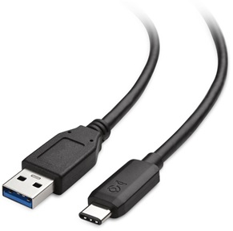
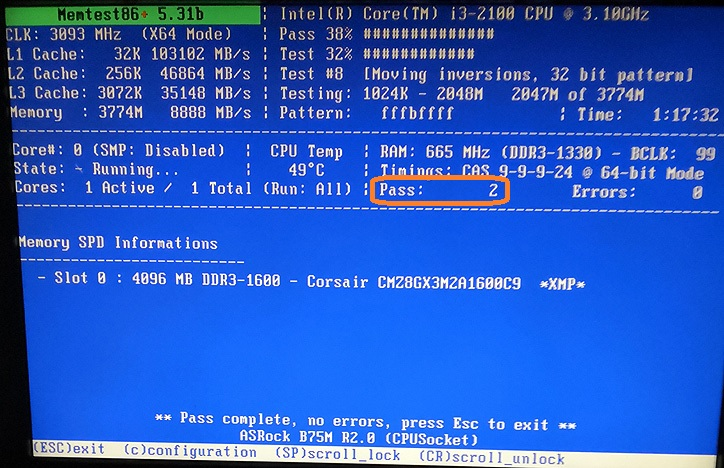
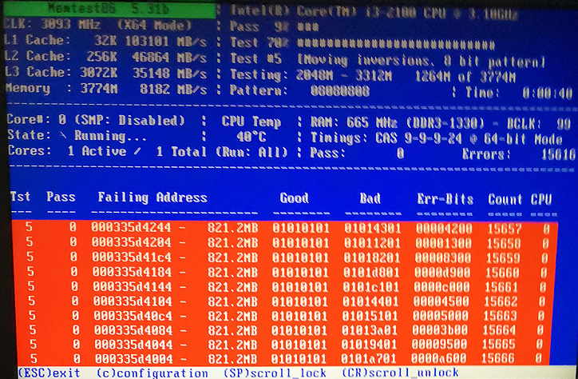

Part1_Environment_Memory.md

# PC ハードウェアの正常性検証（前編）　設置・運用・環境とメモリー
# PC ハードウェアの正常性検証（後編）　ディスクドライブ・電源とまとめ

## テクニカル レベル : 中級

### 概要

Microsoft コミュニティの質問を見ていると、PC ハードウェアの異常に起因するエラーに関する質問が結構あります。
通常、市販のPCのハードウェアはそれほど故障するものではありません。
しかしながら運悪く、一定数の割合で故障してしまうことがあるのも事実です。

Microsoft DOCsの「Windows クライアントのトラブルシューティング」のページにも、個別ハードウェアの正常性を検証する方法は載っていません。

https://docs.microsoft.com/ja-jp/troubleshoot/windows-client/welcome-windows-client?WT.mc_id=WDIT-MVP-35878

そこでWindows PCを正常動作させるために行うべき、ハードウェアの正常性検証方法を項目別にまとめてみました。
PC ハードウェアの正常性検証の参考にして下さい。

通常発生するPCハードウェアの不具合は、主に次の４点に絞られます。

1. 設置・運用・環境
2. メモリー
3. ハードディスク
4. 電源ユニット

## 設置・運用・環境

設置・運用・環境の問題は、トラブル発生時に最初に確認するべき事項です。
ケーブル、コネクター、ソケット、ルーター、スイッチングハブ、外部電源異常といったPC本体以外の運用上の不具合が、この問題の多くの原因です。

最近のPC周辺機器は非常に信頼性が高いですが、それでも運が悪ければ、新しい古いに関わらず、故障している場合があります。
とは言ってもこれらに関する多くの原因はこの項で示す、人為的なものによります。
例えば、PCのコネクターやケーブルを正しく装着できない人は多くいます。
モニター・キーボード・マウス以外にご自身で追加・交換した部品は確実に正しく動作しているのでしょうか。
特にSSD/HDDの追加・換装、カメラ、ビデオ系の周辺機器は注意が必要です。

この項のハードウェア・チェックポイントは比較的簡単です。
- PCの基本動作に不要な周辺機器を一旦外して動作確認をします。
- 全てのソケットとコネクターの正しい、しっかりとした接続を確認します。
- 特定の周辺機器や通信動作が怪しい場合、ケーブルを交換して試してみることも有効です。

## メモリー

一見正しく動作している様に見えるPCでも、実はメモリー異常があることはよくあります。
最初のうちは正常動作していても、使っているうちに動作不良や相性問題が発生する場合もあります。
サーバー用マシン以外の多くのPCは、動作中にメモリーの正常性検証をしないため、メモリー異常に起因する不具合が発生しても分かり難くなっています。

メモリーの検査は、「Memtest86+」というソフトウェアツールを使って行いますので、以下に説明します。

1. まずWindows PCと初期化しても良いUSB メモリー（1MB以上の容量）を用意します。
2. 次の手順で、Download - Auto-installer for USB Key (Win 7/8/10) を選択して zip ファイルをダウンロードします。

3. 入手した memtest86+-5.01.usb.installer.zip（ファイル名はバージョンよって変わる）を右クリック後「すべて展開」を選択して展開します。
4. 用意したUSBメモリーを装着後、展開して出来た Memtest86+ USB Installer.exe を実行、ユーザーアカウント制御を確認します。
5. I Agree をクリックしてライセンス確認します。
6. 書き込み先のUSBドライブを選択して、「We will format」にチェック後「Create」をクリックします。
7. Installation Complete 画面で「Next」をクリック後、次画面で「Finish」で完了です。
8. 書き込みが終わったったUSBメモリーを使用して、テスト対象のPCをUSBメモリーから起動します。
USBメモリーを装着して電源を入れ直すだけで起動する場合もありますが、
環境によってはUEFI/BIOSの設定変更や、電源ON時に「F1」等の特殊キー押下による一時的なブートデバイス変更が必要です。
メモリーテストは自動的に起動して進みます。一連のテストが終了するのには、3時間程度かかります。
PASSのサイクルが2回以上になったらば、その環境のメモリーは問題無いと考えて良いです。
★★
異常がある場合は、次の様に画面上にエラーが報告されます。
★★

★★

メモリーテストツールは、「Memtest86+」以外にも同種のMemtest系ツールがあり、またLinuxや他のOSとともにインストールされる場合もあります。
しかし「Memtest86+」は同じ環境で試した場合に、他のツールよりもより早く、より厳しく問題を発見することが多いため、知っておいて損は無いと思います。

今回は、PC ハードウェアの正常性検証の前編として、まず基本的な設置・運用・環境の確認と「Memtest86+」によるメモリーテスト手順を示しました。
後編に続きます。
