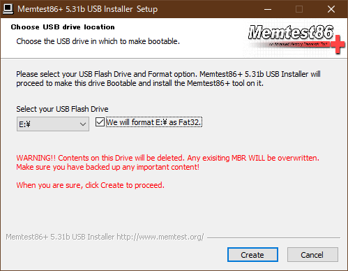

# PC ハードウェアの正常性検証（Part 1）　設置・運用・環境とメモリー

## テクニカル レベル : 中級

### 概要

Microsoft コミュニティの質問を見ていると、PC ハードウェアの異常に起因するエラーに関する質問が結構あります。
通常、市販のPCのハードウェアはそれほど故障するものではありません。
しかしながら運悪く、一定数の割合で故障してしまうことがあるのも事実です。

[Microsoft DOCsの「Windows クライアントのトラブルシューティング」のページ](https://docs.microsoft.com/ja-jp/troubleshoot/windows-client/welcome-windows-client?WT.mc_id=WDIT-MVP-35878)にも、個別ハードウェアの正常性を検証する方法は載っていません。

Windows の不具合は、システムファイルやファイルシステム異常といったソフト的な問題が原因の場合もありますが、まずはハードウェアの正常動作を確認した上で問題の原因を見極めて、対策するのが定石です。そこでWindows PCを正常動作させるために行うべき、ハードウェアの正常性検証方法を項目別にまとめてみました。PC ハードウェアの正常性検証の参考にして下さい。

通常発生するPCハードウェアの不具合は、主に次の４点に絞られます。

1. 設置・運用・環境
2. メモリー
3. ハードディスク
4. 電源ユニット

## 設置・運用・環境

設置・運用・環境の問題は、トラブル発生時に最初に確認するべき事項です。
ケーブル、コネクター、ソケット、ルーター、スイッチングハブ、外部電源異常といったPC本体以外の運用上の不具合が、この問題の多くの原因です。

最近のPC周辺機器は非常に信頼性が高いですが、それでも運が悪ければ、新しい古いに関わらず、故障している場合があります。
とは言ってもこれらに関する多くの原因はこの項で示す、人為的なものによります。
例えば、PCのコネクターやケーブルを正しく装着できない人は多くいます。
モニター・キーボード・マウス以外にご自身で追加・交換した部品は確実に正しく動作しているのでしょうか。
特にSSD/HDDの追加・換装、カメラ、ビデオ系の周辺機器は注意が必要です。

この項のハードウェア・チェックポイントは比較的簡単です。
- PCの基本動作に不要な周辺機器を一旦外して動作確認をします。
- 全てのソケットとコネクターの正しい、しっかりとした接続を確認します。
- 特定の周辺機器や通信動作が怪しい場合、ケーブルを交換して試してみることも有効です。

## メモリー

一見正しく動作している様に見えるPCでも、実はメモリー異常があることはよくあります。
最初のうちは正常動作していても、使っているうちに動作不良や相性問題が発生する場合もあります。
サーバー用マシン以外の多くのPCは、動作中にメモリーの正常性検証をしないため、メモリー異常に起因する不具合が発生しても分かり難くなっています。

メモリーの検査は、「Memtest86+」というソフトウェアツールを使って行いますので、以下に説明します。

### ダウンロード

1. まずWindows PCと、初期化しても良いUSB メモリー（1MB以上の容量）を用意します。
2. http://memtest.org/ をブラウザで開き、**[Download (Pre-build & ISOs)](http://memtest.org/#downiso)** をクリックします。

3. **Download - Auto-installer for USB Key (Win 7/8/10)** をクリックして zip ファイルをダウンロードします。

### インストール

1. 入手した memtest86+-5.01.usb.installer.zip（ファイル名はバージョンよって変わる）を右クリック後「すべて展開」を選択して展開します。
2. 用意したUSBメモリーを装着後、展開して出来た Memtest86+ USB Installer.exe を実行、ユーザーアカウント制御を確認してインストールを開始します。
3. I Agree をクリックしてライセンス確認します。

4. 書き込み先のUSBドライブを選択して、「We will format」にチェック後「Create」をクリックします。USBメモリーへの書き込みが始まります。

5. Installation Complete 画面で「Next」をクリック後、次画面で「Finish」で完了です。

### 起動

書き込みが終わったったUSBメモリーを使用して、テスト対象のPCをUSBメモリーから起動します。
USBメモリーを装着して電源を入れ直すだけで起動する場合もありますが、環境によってはUEFI/BIOSの設定変更や、電源ON時に「F1」等の特殊キー押下による一時的なブートデバイス変更が必要です。

メモリーテストは自動的に起動して進みます。一連のテストが終了するのには、2～3時間程度かかります。次に示す様にPASSのサイクルが2回以上になったらば、その環境のメモリーは問題無いと考えて良いです。

メモリー環境に異常がある場合は、次の様に画面上に赤い背景でエラーが報告されます。

メモリーテストツールは、「Memtest86+」以外にも同種のMemtest系ツールがあり、またLinuxや他のOSとともにインストールされる場合もあります。
しかし「Memtest86+」は最新のテスト内容と環境向けに更新されていて、同じ環境で試したときには他のツールよりもより早く、より厳しく問題を発見することがありました。知っておいて損は無いと思います。

今回は、PC ハードウェアの正常性検証の前編として、まず基本的な設置・運用・環境の確認と「Memtest86+」によるメモリーテスト手順を示しました。

[Part 2](Part2_Diskdrive_Powerunit.mdに続きます。)
