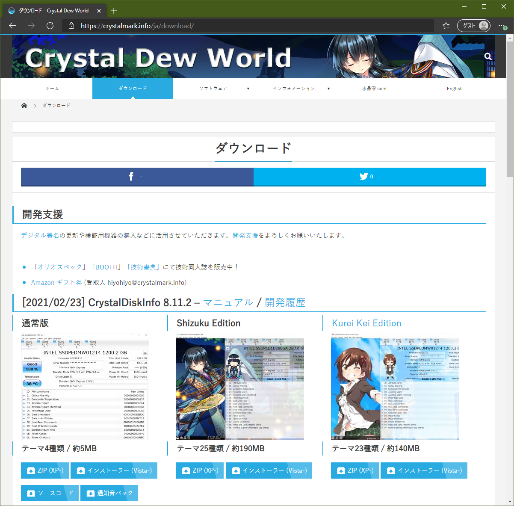
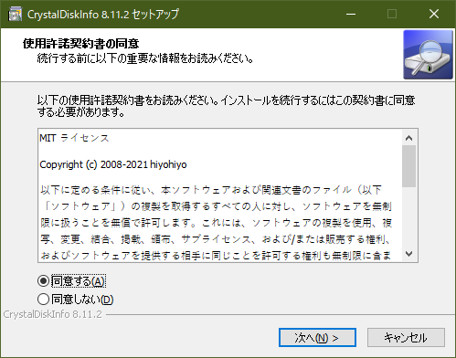
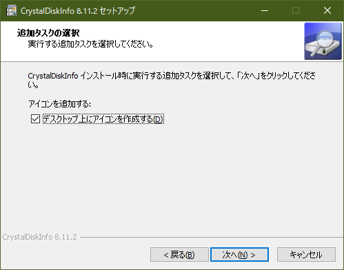
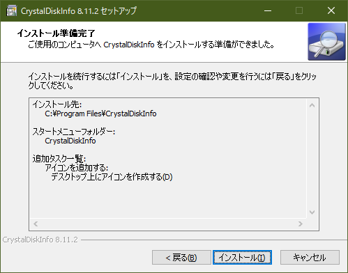
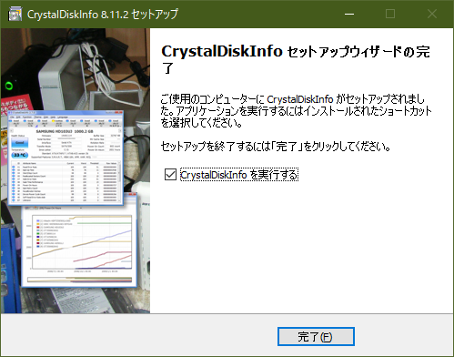
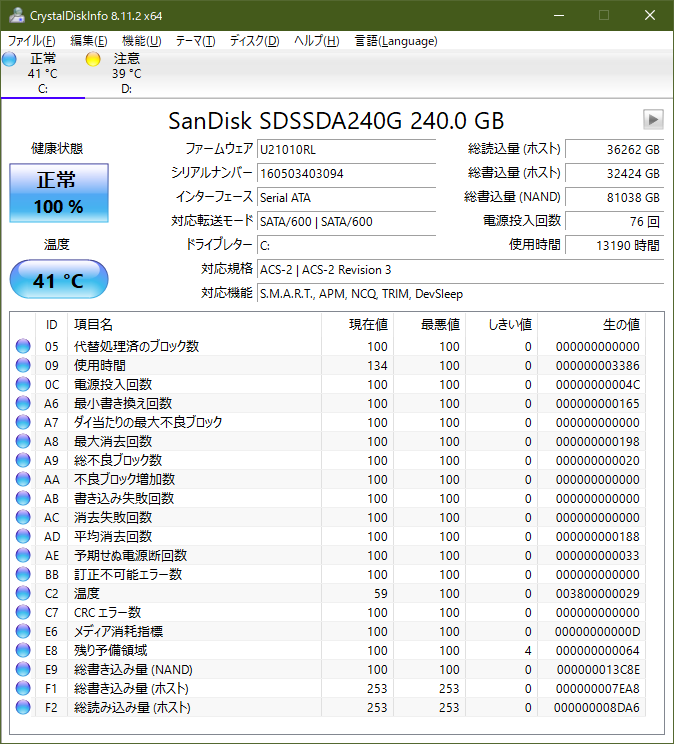
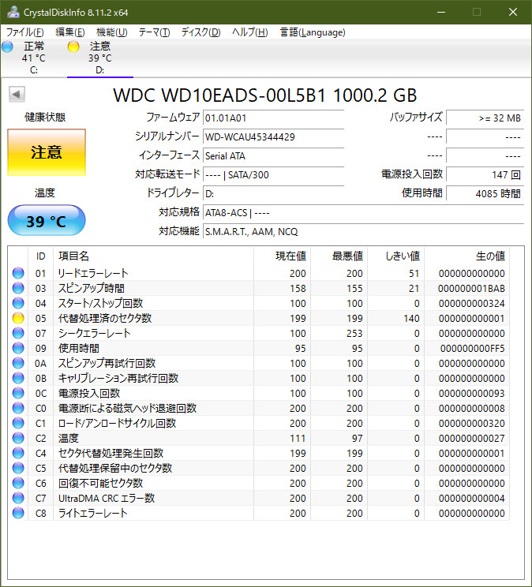

Part2_Diskdrive_Powerunit.md

# PC ハードウェアの正常性検証（Part 1）　設置・運用・環境とメモリー
# PC ハードウェアの正常性検証（Part 2）　ディスクドライブ・電源とまとめ

## テクニカル レベル : 中級

### はじめに

このページは、PC ハードウェアの正常性検証（Part 1）の続きです。
次の4点の通常発生するPCハードウェアの不具合のうち、ハードディスクと電源ユニットの検証方法について示します。
設置・運用・環境とメモリーの検証については、Part1 を参照してください。

1. 設置・運用・環境
2. メモリー
3. ハードディスク
4. 電源ユニット

## ハードディスク

現在のディスクドライブ(SSD/HDD)は、それ自体が小さなコンピューターです。
ドライブのRead/Writeには記録メディア（磁性体やメモリー）エラーが付き物です。ドライブでは、記録データを保全しながらメディアの寿命を伸ばすために、エラー訂正技術と状況に応じたリトライ、バッドブロックと呼ぶ不良なメディア部分を記録して避ける仕組みが動作しています。
そしてドライブの不具合のほとんどが、このバッドブロックの発生や管理の不具合に起因しています。

各ドライブは特殊な管理領域に過去の自分自身の動作やエラーの記録を持ち、保全しています。
SMART (S.M.A.R.T. Self-Monitoring, Analysis and Reporting Technology)と呼ぶ、この管理情報を参照することで、
現在のドライブの状態や過去のエラー履歴を確認することができます。
CrystalDiskInfoというWindows上で動作するツールを利用することで、容易にこの各ドライブの状態や健全性、SSDの寿命を確認することができます。

## CrystalDiskInfoの使い方

ここではディスクドライブを利用して行く上で欠かせない、有用なツールである **CrystalDiskInfo** について説明します。

### ダウンロード

様々なサイトから入手可能ですが、ここでは本家のダウンロードページからの入手について説明します。
通常はインストーラーをクリックしてダウンロードすることをお勧めします。

https://crystalmark.info/ja/download/

### インストール

入手した CrystalDiskInfo8_11_2.exe（数字はバージョンによって異なる）をクリック後、ユーザーアカウント制御を確認してインストールを開始します。最初はライセンスの確認画面です。

デスクトップアイコン作成の確認画面です。

インストール開始の確認画面です。

インストール完了後の起動確認画面です。

## 起動と検査

起動直後の画面です。基本的には見るだけのツールなので、ドライブ選択以外の操作は必要ありません。
全く問題が無い場合は、この様に水色のマークになります。

代替セクター（バッドブロックの置き換え）が発生している状態の画面です。
代替処理保留中のセクターがある場合には、今後データの損失の可能性があるため、注意が必要です。
ドライブが不良な場合やメディアが高温の場合には、赤色アイコンで異常を伝えます。

もし代替処理保留中のセクターがある場合には、まず問題があるドライブのファイルをバックアップした上で、物理フォーマットやスキャンツールを使用したドライブ・スキャン等をして、保留中のセクターをゼロにしておきます。

この様に入手、インストールとも簡単なツールのため、Windowsをインストールしたときには必ず入れておいても良いのではないでしょうか。

## 電源
ケーブル類や環境も正しい、メモリー、ディスクも異常が無いといった場合には、電源ユニットが問題の可能性があります。
電源ユニットの異常は一般的に「電源が入らない」「運用中に突然電源が切れる」「異臭がする」といった症状があるため、分かり易いです。

しかし厄介なのは、正常動作している様に思えても、電源ユニットの不良や容量不足が原因の問題が発生している場合があることです。デスクトップPCでは、グラフィックボードを追加・交換する場合がありますが、電源容量が足りているでしょうか？
バスパワーUSBデバイスの中には結構電力を消費するデバイスがあります。

また、電源ユニットは実質的に消耗品のため、一見正常動作している様に見えても、経年劣化している場合があります。
最初のうちは正常動作していても、コンデンサー等の内部部品が劣化して、4年5年と経つうちに不具合の原因となることはよくあります。
デスクトップ型自作パソコンであれば、別の電源ユニットに交換して試すのが、手っ取り早い問題解決方法です。
ワットチェッカー等を使用して、消費電力が予定の範囲内か確認する方法もあります。
環境要因も確認して、メモリーやディスクが正常なのに、何かおかしい場合には疑ってみる部分です。

## まとめ
Windowsの調子が悪いとき、Windowsの不具合を疑う前に、次のチェックをしてみましょう。
- 設置・運用・環境（コネクター、ケーブル類、追加変更した周辺機器の確認）
- メモリー（Memtest86+）
- ディスクドライブ（CrystalDiskInfo）
- 電源の検証または交換

これらが正常であることをまず確認してから、次の様なソフト的な不具合を疑ってみます。

- ファイルシステムのエラー（chkdskコマンドによる論理エラー確認と修復）

https://docs.microsoft.com/ja-jp/windows-server/administration/windows-commands/chkdsk?WT.mc_id=WDIT-MVP-35878

- システムファイルのチェック（sfcコマンドによるシステムの整合性確認と修復）

https://docs.microsoft.com/ja-jp/windows-server/administration/windows-commands/sfc?WT.mc_id=WDIT-MVP-35878

Windows PCの不調には必ず何らかの理由があります。
まずはハードウェアの正常性検証ツールを使用して、状態を確認してみることをお勧めします。
