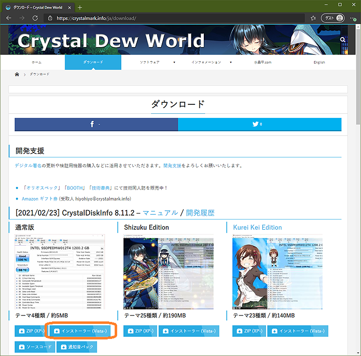

Part2_Diskdrive_Powerunit.md

# PC ハードウェアの正常性検証（Part 1）　設置・運用・環境とメモリー
# PC ハードウェアの正常性検証（Part 2）　ディスクドライブ・電源とまとめ

## テクニカル レベル : 中級

### はじめに

このページは、PC ハードウェアの正常性検証（Part 1）の続きです。
次の4点の通常発生するPCハードウェアの不具合のうち、ハードディスクと電源ユニットの検証方法について示します。
設置・運用・環境とメモリーの検証については、Part1 を参照してください。

1. 設置・運用・環境
2. メモリー
3. ハードディスク
4. 電源ユニット

## ハードディスク

現在のディスクドライブ(SSD/HDD)は、それ自体が小さなコンピューターです。
ドライブのRead/Writeには記録メディア（磁性体やメモリー）エラーが付き物です。ドライブでは、記録データを保全しながらメディアの寿命を伸ばすために、エラー訂正技術と状況に応じたリトライ、バッドブロックと呼ぶ不良なメディア部分を記録して避ける仕組みが動作しています。
そしてドライブの不具合のほとんどが、このバッドブロックの発生や管理の不具合に起因しています。

各ドライブは特殊な管理領域に過去の自分自身の動作やエラーの記録を持ち、保全しています。
SMART (S.M.A.R.T. Self-Monitoring, Analysis and Reporting Technology)と呼ぶ、この管理情報を参照することで、
現在のドライブの状態や過去のエラー履歴を確認することができます。
CrystalDiskInfoというWindows上で動作するツールを利用することで、容易にこの各ドライブの状態や健全性、SSDの寿命を確認することができます。

CrystalDiskInfoの使い方

### ダウンロード

### インストール

## 起動と検査

起動

## 電源
ケーブル類や環境も正しい、メモリー、ディスクも異常が無いといった場合には、電源ユニットが問題の可能性があります。
デスクトップPCの場合は、電源容量が足りているでしょうか？
電源ユニットは実質的に消耗品のため、一見正常動作している様に見えても、経年劣化している可能性があります。
つまり最初のうちは正常動作していても、コンデンサー等の内部部品が劣化して、4年5年と経つうちに不具合の原因となることはよくあります。
デスクトップ型自作パソコンであれば、別の電源ユニットに交換して試すのが、手っ取り早い問題解決方法です。
ワットチェッカー等を使用して、消費電力が予定の範囲内か確認する方法もあります。

## まとめ
Windowsの調子が悪いとき、Windowsの不具合を疑う前に、次のチェックをしてみましょう。
- 設置・運用・環境（コネクター、ケーブル類、追加変更した周辺機器の確認）
- メモリー（Memtest86+）
- ディスクドライブ（CrystalDiskInfo）
- 電源の検証または交換

パソコンが不調だからだましだまし使っているとか、パソコンが古くなったから調子が悪いのは当たり前という様な話を結構聞きますが、
実際にはハードウェアの不具合が関連している事がほとんどです。
実はWindows 10ではハードウェアが正常であれば、古いパソコンでも問題なく動作することがほとんどなので、★★★★

